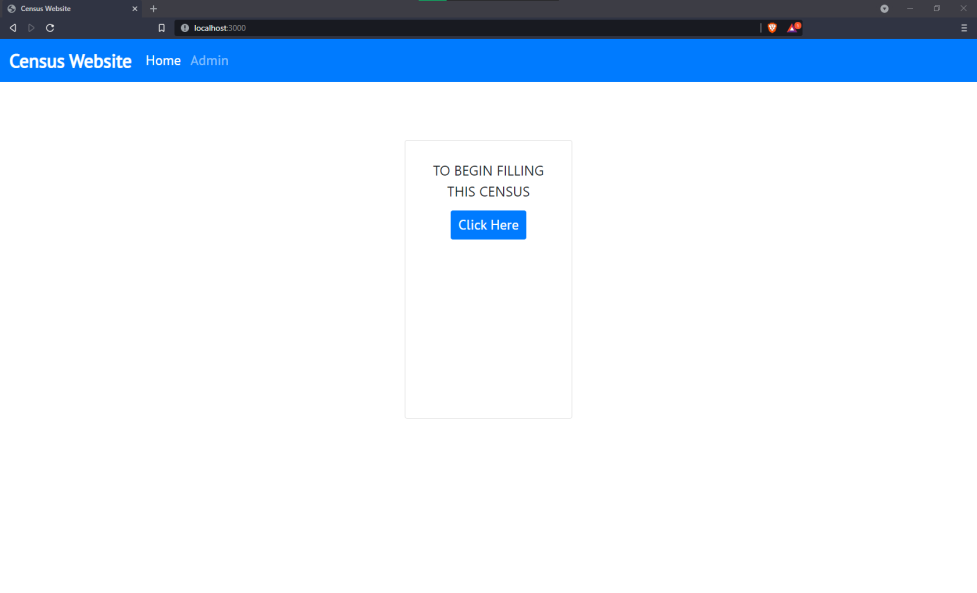
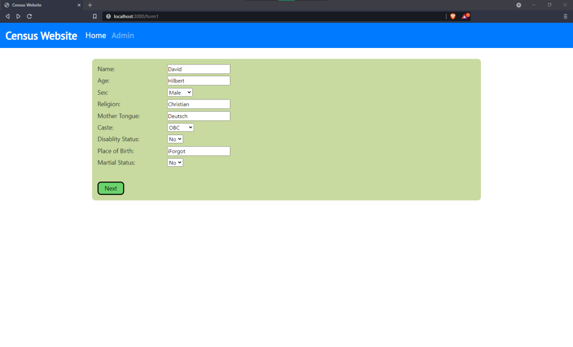
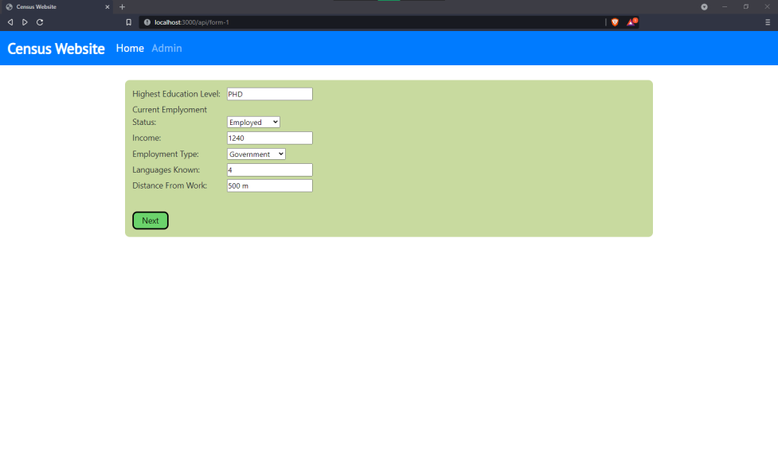

# CENSUS HOSTING WEBSITE 

### Deployment
https://census-hosting.herokuapp.com/

### _Description :_
_The home page of census website is shared in mass , users respond with their data._
_Admins with their passwords and usernames are able to log in and view the data in some form_

#### Objectives
- [x] 3 Pages of input {Personal, Professional and Others}
- [x] Admin Login 
- [ ] Structed Data View for Admin
- [x] Deployment on Heroku 

#### Instructions:
To Deploy on your own machine after downloading the zip.
1. In packages.json, on line 7:20 , edit out node and change it to nodemon 
2. run npm install 
3. Edit the variables in config.env
  - PORT alters location of local server which will run on localhost:$PORT$
  - MONGO_URI is the location of your database on mongoATLAS.

### Sample Image 

